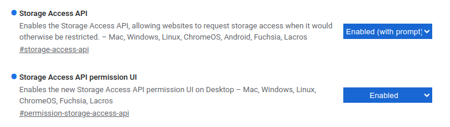

# How Google Chrome is implementing the Storage Access API

Chrome [recently indicated](https://github.com/privacycg/storage-access/pull/165) that it will implement and support the [Storage Access API](https://github.com/privacycg/storage-access). This means that Chrome will implement all the behaviors and APIs listed in the [specification](https://privacycg.github.io/storage-access/), and will additionally have its own user-agent-specific behaviors (the same way that Safari and Firefox [currently do](https://developer.mozilla.org/en-US/docs/Web/API/Storage_Access_API#safari_implementation_differences)). The below is a description of Chrome's plans for its implementation-defined behavior; these plans may evolve over time.

This document includes [instructions](#testing-instructions) for how to test these semantics locally, in order to evaluate whether they'll work for your use case.

## Announcements

Check back here for links to announcements of shipping timelines, etc., once those have been published. We will post to [blink-dev@chromium.org](https://groups.google.com/u/1/a/chromium.org/g/blink-dev) (as per the usual [Blink shipping process](https://blog.chromium.org/2019/11/intent-to-explain-demystifying-blink.html)) when we're ready.

* [Intent to Prototype](https://groups.google.com/u/1/a/chromium.org/g/blink-dev/c/zt-nqGpURNY)
* [Intent to Ship](https://groups.google.com/u/1/a/chromium.org/g/blink-dev/c/JHf7CWXDZUc)

# Design Details
## Behaviors defined in the specification

Every browser that implements the specification faithfully has a set of predictable behaviors when the API's methods are invoked. The spec lays these out in detail for both [`document.hasStorageAccess`](https://privacycg.github.io/storage-access/#dom-document-hasstorageaccess) and [`document.requestStorageAccess`](https://privacycg.github.io/storage-access/#dom-document-requeststorageaccess), including the order in which all of the various preconditions are checked.

As a high-level summary, every spec-compliant browser will do the following for a call to `document.requestStorageAccess`:
1. Run a series of security checks to see if the document should be disallowed from getting the `storage-access` permission. (This includes things like checking whether the document's window's origin is opaque, checking [Permissions Policy](https://developer.mozilla.org/en-US/docs/Web/HTTP/Permissions_Policy), checking that the document's window is a [secure context](https://html.spec.whatwg.org/multipage/webappapis.html#secure-context), etc.) Also check for a few situations where the promise can be trivially resolved (e.g. if the document is a top-level document).
1. If `document.requestStorageAccess` has already been called (and resolved) in this window, resolve the promise and return.
1. Check to see if the browser has a pre-existing grant/denial for the `storage-access` permission for this `<embedded site, top-level site>` pair. If so, reuse that decision and resolve/reject the promise accordingly, and return.
1. Check that this call has [transient activation](https://developer.mozilla.org/en-US/docs/Glossary/Transient_activation).  If not, reject the promise and return.
1. Request `storage-access` permission. **_The details of this step vary across different browsers._** If permission is granted, set the window's state appropriately, and resolve the promise. Otherwise, handle the user interaction and reject the promise.

## Chrome-specific behavior

### Requesting `storage-access` permission

As noted above, the final step of the algorithm is partially implementation-defined, so that different browsers have leeway to implement their own policies and constraints. Firefox's and Safari's behavioral differences are documented [here](https://developer.mozilla.org/en-US/docs/Web/API/Storage_Access_API#safari_implementation_differences). Chrome's behavior when `document.requestStorageAccess` requests the `storage-access` permission is as follows:.

1. Check if the embedded site and the top-level site are in the same Related Website Set (formerly known as First-Party Set). If so, grant permission to `<embedded site, top-level site>`, and return.<sup>[1](#footnote1)</sup>
1. If the user has not interacted with the embedded site in a top-level context (i.e. while the embedded site is shown in the Chrome Omnibox) within the last 30 days, keep the permission status as "ask", and return.<sup>[2](#footnote2)</sup>
1. Issue a prompt to the user to ask whether the user wants to grant permission, deny it, or ignore the request.

### Obtaining `storage-access` permission in other ways

A key point in the `document.requestStorageAccess` algorithm is that it checks for a pre-existing permission grant/denial, before checking for transient activation and before actually requesting permission. This gives spec-compliant browsers some flexibility: browsers can grant `storage-access` permission based on other signals, in addition to explicit requests via `document.requestStorageAccess`.

With that in mind: there will be at least one additional way to grant `storage-access` permission in Chrome:

* Via [`document.requestStorageAccessFor`](https://github.com/privacycg/requestStorageAccessFor). This API is the gateway to requesting the `top-level-storage-access` permission, which is a superset of the `storage-access` permission. As such, successful calls to `document.requestStorageAccessFor` also create a `storage-access` permission grant. Currently, this API is only supported within Related Website Sets in Chrome.

### Permission lifetimes

Similar to the above, a browser can also control the lifetimes of the `storage-access` permission grants/denials it creates, such that those decisions expire at different times based on the source of the grant and on the user's behavior.

* Permission grants via `document.requestStorageAccess` due to Related Website Set membership will have a lifetime of 30 days. We previously chose a shorter lifetime here, since sites in the same Related Website Set can call `document.requestStorageAccess` again once the grant expires, and Chrome will auto-grant the request; but we have since decided that requiring a user gesture more frequently for RWS sites than for unrelated sites is an unnecessary "penalty".
* Permission grants and denials via `document.requestStorageAccess` and the user prompt will have a lifetime of 30 days.
* Permission grants via `document.requestStorageAccessFor` have a duration of 30 days. Chrome does not support `document.requestStorageAccessFor` usage outside of Related Website Sets, so this lifetime was chosen for the same reasons noted above.

In addition to choosing different grant lifetimes, Chrome will allow certain user behaviors to "renew" relevant grants, resetting their lifetimes to what they originally started as (depending on the source of the grant). In particular:

* When the user [interacts](https://html.spec.whatwg.org/multipage/interaction.html#user-activation-data-model) with an embedded site foo.com (embedded in top-level top.com), the browser renews the `storage-access` permission grant with key `<foo.com, top.com>`, if it exists.

### User controls

Other browsers have implemented a prompting flow as a means to provide the user the opportunity to choose whether to allow the embedded site access to its cookies. While deferring to users to make a choice can be a way to provide privacy controls to users, there are several challenges to consider to ensure that users are, in fact, in a position to make an informed decision.

The following are challenges that Chrome is navigating to deliver the optimal user experience: 
* Avoiding prompt fatigue
* Providing relevant context to users to help them make informed choices

In alignment with the spec, a new `storage-access` permission grant can only be created<sup>[3](#footnote3)</sup> if the request has transient activation. Additionally, Chrome will require a previous user interaction on that third-party site in a top-level context to mitigate the risk of unfamiliar or unexpected requests from third parties.

When such requirements are satisfied and an embedded third-party requests storage access, Chrome will ask the user whether to grant the permission. 
* If the user grants the permission, Chrome will store it, setting the lifetime as detailed in [Permission lifetimes](#permission-lifetimes) to minimize prompt frequency and related friction. During the lifetime of a permission grant, the user will not be prompted for subsequent access requests that match the scope of the grant.
* If the user denies the request, Chrome will store the denial, setting the lifetime as described above. During the lifetime of a permission denial, the user will not be prompted for subsequent access requests that match the scope of the denial.
* If the user dismisses the request, Chrome will not store any decision, and will not grant the permission. The embedded site can continue to request permission, and those requests may create prompts in the future.

In Chrome's settings, users will be able to view a list of previously granted and denied permissions, and be able to revoke past decisions. This feature will provide users with transparency and control, and it will also allow developers to test the API with expected user behaviors on their local machine. (As of Chrome 117, this UI is available at `chrome://settings/content/storageAccess`.)

When Chrome ships the Storage Access API to address a broader suite of use cases, we anticipate learnings that will inform how to best communicate to users about the permission being requested. We are committed to delivering a meaningful user experience that balances privacy and frictionless browsing.

### Testing instructions

Chrome's implementation can be tested today in Chrome M117. (At the time of writing, M117 is available on the [Canary](https://www.google.com/chrome/canary/) channel of Chrome; [in the future](https://chromiumdash.appspot.com/schedule), it will also be available on the [Beta](https://www.google.com/chrome/beta/) and [Dev](https://www.google.com/chrome/dev/) channels.) To enable the behaviors described in this doc locally, you can enable two flags on `chrome://flags`. Specifically, set the `#storage-access-api` flag to "Enabled (with prompt)"; set the `#permission-storage-access-api` flag to "Enabled". Then, restart your browser (using the button at the bottom of `chrome://flags`, or by visiting `chrome://restart`) to make the flags take effect.



It's also possible to enable this functionality via the command-line, using Chrome's `--enable-features` option with the right comma-separated list of flags, like this:

```
google-chrome \
--enable-features="StorageAccessAPI:storage_access_api_auto_deny_outside_fps/false,PermissionStorageAccessAPI"
```

When testing your site, please be sure that it satisfies the Storage Access API's constraints (particularly its [security measures](https://developer.mozilla.org/en-US/docs/Web/API/Storage_Access_API#security_measures)) as well as [Chrome's additional constraints](#requesting-storage-access-permission).

If you uncover bugs in Chrome's behavior while testing locally, please [file a bug](https://bugs.chromium.org/p/chromium/issues/entry?components=Blink%3EStorageAccessAPI)!

----

<a name="footnote1">1</a>: This follows the [Related Website Sets specification](https://wicg.github.io/first-party-sets/#storage-access-integration) which Chrome implements, but which is not supported by other browsers at the moment.

<a name="footnote2">2</a>: Note that this will cause the `document.requestStorageAccess` promise to reject, since permission was not granted.

<a name="footnote3">3</a>: Note that this is different from whether the promise returned by `document.requestStorageAccess` resolves or rejects! The promise will resolve if there's already a matching permission grant, or if a new one is created. But user activation is only required if there is _no_ pre-existing permission grant, and therefore permission must be requested.
